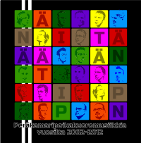
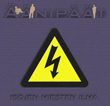
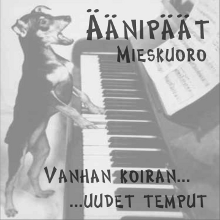



****

  

  
<b>Mieskuoro Äänipäät</b> on kuoro Vetelistä Keskipohjanmaalta.

 
  <!--  -->

  

  

    

      <h1>Uusimmat jutut</h1>

      <ul>
          
          <li>{{ post.date | date_to_string }} &raquo; <a href="{{ BASE_PATH }}{{ post.url }}">{{ post.title }}</a></li>
              {{ post.content | strip_html | truncatewords:15}} 
                  <a href="{{ post.url }}">Lue lisää...</a>  
          
      </ul>

      
Kasso lisää juttuja <a href="archive.html">arkistosta</a>

    

  

  

***

# Yhteystiedot

## Keikkamyynti, PR
Juho Norrena  
puh: 050 571 1077

## Puheenjohtaja
Jussi Koivumäki  
puh: +47 40485651

***

# Äänitteet

## Peräkamaripoikakuoromusiikkia vuosilta 2002-2012 (2012)

Levyä on saatavilla kaikilta hyvinvarustetuilta äänipäiltä! Ulkomailla ja syrjäseuduilla asuvien on mahdollista tilata levyä osoitteesta: levy2012@aanipaat.net

1. [Rakkauden Raippa](/sanat.html#rakkauden-raippa)
2. [MM 95](/sanat.html#mm-95)
3. [Kesä Vetelissä](/sanat.html#kesä-vetelissä)
4. [Meteorologiaa](/sanat.html#meteorologiaa)
5. [Tax Free](/sanat.html#tax-free)
6. [Kaustisilla](/sanat.html#kaustisilla)
7. [Isojen miesten ilma (Ukkonen)](/sanat.html#isojen-miesten-ilma-ukkonen)
8. [Mies ja siideri](/sanat.html#mies-ja-siideri)
9. [Enon veneessä](/sanat.html#enon-veneessä)
10. [Kahvihuoneilmiö](/sanat.html#kahvihuoneilmiö)
11. [Panis Angelicus](/sanat.html#panis-angelicus)

## Isojen miesten ilma (2004)

1. Isojen miesten ilma (Ukkonen)
Haavisto
2. Mies ja siideri
Kainu/Kainu/Haavisto
3. Rekka miehen tiellä pitää
Kainu/Kainu/Kalliokoski

Ensimmäinen virallinen äänite, Isojen miesten ilma, ehti sopivasti joulumarkkinoille joulukuussa 2004. Sinkku sisältää pelkästään Äänipäiden omaa tuotantoa olevia kappaleita ja edustaa siinä mielessä ryhmää parhaalla mahdollisella tavalla. Tämä äänite kuuluu ehdottomasti jokaisen itseään kunnioittavan laulajan tai muusikon levyhyllyyn. Voit tiedustella levyä hyvin varustetuilta äänipäiltä.

## Vanhan koiran uudet temput (2002)

1. What Can I Do
(The Corrs)
2. Caravan of Love
(The Housemartins)
3. Hän kulkevi kuin yli kukkien
(Leevi Madetoja)

Tutuista palikoista kootun uuden kokoonpanon toimivuutta testattiin pyöräyttämällä kolmen biisin sinkku promootio tarkoituksiin.

***

# Laulajat

## Ykköstenorit

  
**Juha "Juhis" Järvelä** 
Juha ei kanna kivirekiä perässään vaan hyppää issekki kyythin. Juhan mottona: "Näläkä kasvaa toisten syöresä."

  
**Jussi "Jüssi" Koivumäki** 
Jussi, veljistä viisain, porukan järjenääni, joka pitää hommat käsissä ja suitset suussa. Jussin motto: "Ei täsä palavan jäniksen seläsä olla!"

  
**Tero "Teitsi" Lindholm** 
Tero on niin taitava muusikko, että tekee jokaisessa ruokapöytäkeskustelussa modulaation – alaspäin. Teron tunnuslause: "Menthin törkiän kolokosti meshän ja vissa löi törkiän kolokosti oshan!"

  
**Jari "Jape" Torppa** 
Kun etsitään joukon suurinta torppaa, kääntyvät katseet Japeen. Motto: "Mikäs täsä valamhisa maailmasa!"

## Kakkostenorit

  
**Tero "Jaffa" Hyväluoma** 
Sai kuoroon kiintiöpatanalaisen paikan. Mutta huomathin, että hetkö patanalaisia on porukasa kaks, rupiaa niiren jutut keskittyhän vain Kyläkaupan asioihin. 
Motto: "Haiseeko henki?"

  
**Tommi "Tommi" Järvelä** 
Sanasta Tommi, on tullut Äänipäissä jo käsite. Eikä vähiten Tommin ansiosta. Kun homma toimii, Tommi sanoo: "Homma toimii!"

  
**Miika "Kuningas" Kangas** 
Miika on kuningas, paitsi sillon, kun ei oo fiilista. Miikan tunnuslauseena: "Issensä näkönen kö kissa."

  
**Tarmo "Tare" Läspä** 
Jostain kumman syystä kakkostenorit ovat muita Äänipäitä hedelmällisempiä. Tähän Tarmo onkin osuvasti todennut: "Se, mitä ennen juhannusta sataa, sataa laarhin."

  
**Juho-Matti "Motti" Norrena** 
Aika moni tietää, mitä satiaiset sano ko joutu piiritetyks? Vain yksi tietää miltä se tuntuu. Motto: "Ihannenaisella on koriat silimät ja tekee lämpimän paskan."

  
**Mikko "Supermies" Nygård** 
Mikko on mies läheltä luontoa ja tokaiseekin usein: "Mikko ko käskee, se saa vaikka messän istuuntuhan."

  
**Riku "Riksa" Seppälä** 
Rikulla on joskus huono muisti ja sillon Rikua pitää muistuttaa, että sulla on nyt soolo menossa. Rikun motto: "Renkimies, ko pellolla seisoo ja ojhan kusee."

## Ykkösbassot

  
**Matias "Madde" Haavisto** 
Matiasta näkee, tai kuulee, harvoin, mutta kun näkee, tai kuulee, ei voi olla huomaamatta. Motto: "Minä laitoin ikkunaan paffisuojan, että edes jossakin lämmin ois."

  
**Kristian "Krisse" Jäger** 
Kukapa ei tykkäisi olla kalsareissa, mutta tämä mies saa siitä palkkaa. Krissen elämänlankana: "Mikä pitsa!? Se on juustopiirakka Puusaaresa!"

  
**Kari "Karpov" Kalliokoski** 
Ihmiskunnan historiassa on vain muutamia ihmisiä, jotka ovat maksaneet paikallisbussin kyydistä 5,60. Kari on eräs heistä. Samalla kuoron taiteellinen johtaja: "Puolet paskaa niinku Toholammin tytön pierusa."

  
**Sami "Don" Pajukangas** 
Juttu kuin juttu, Don hoitaa homman, no ei nyt senthän ihan kaikkea. Mottona: "Nyt laulethan rehevällä tunthella".

  
**Matias "Jaaka" Tyni** 
Matias on taskulaulamisen mestari ja toteaakin usein: "hnngh" nenäänsä pidellen. Matias on myös tosi puhdas laulaja, mutta hänen äänensä hieman vuotaa, saataraviete! Ja suuääniki vuotaa! Matiaksen mottona: "semmosta" 

## Kakkosbassot

  
**Tero "Haryu" Harju** 
Tero osaa heittää tosta vaan bluussia harpulla, metallicaa ilmakitaralla tai jatsia nopalla. Mainio mies, jonka mottona: "Ei meillä tämmöstä Puusaaresa!"

  
**Mika "Miguli" Jäger** 
Mika laulaa yhtä aikaa korkialta ja matalalta. Lisäksi hänellä on bassoksi poikkeuksellisen laaja tavuvalikoima. Häneltä sujuu sekä ”pam” että ”pom” ilman epäuskoista pälyilyä. Elämässä ohjenuorana on aina ollut: ”Ei koriasta naamasta monta velliä keitetä!”

  
**Markus "Make" Kainu** 
Suunnistaa sukkelasti, kokkaa taitavasti, ja katoaa pyöränsä kanssa auringonlaskuun. Elämänohjeena: "Ko isse tekee ni saa mitä tulee."

  
**Lauri "Late" Koskimaa** 
Late, liukas luikku, raatavi pellolla kuin sen seitsemän karhua. Motto: "Maastavetoon se pieniki ponnistaa – törkiän kolokosti!"

  
**Toni "Toni" Mikkola** 
Mies joka suunnittelee kelluvia kaivureita ei paljon muita perusteluja kaipaa. Tosimies isolla K:lla! Motto: "Hoo, minä oon Toni."

  
**Joni "Jonde" Teirikangas** 
Jos kysytte, onko tämä se Joni, joka liitty kuorhon 2009 ja jonka esittelyä justhan luet, ni on se! Sama mies eikä oo muuttunu yhtään siitä ko viimeks olthin naisisa Evijärvellä. Motto: "Olokhon ny nuin kirkolle asti."

****

<!-- # Ohjelmisto

Kuikan huuto kiirii kesäyössä. Se saa nuotiolla istuvan paatuneen tukkijätkän kyyneliin. Mieleen muistuvat lapsuus, nuoruus ja kadotettu rakkaus – nuo ajat, jotka eivät koskaan palaa, vaikka ovat tatuoituneina mielen sopukoihin joka hetkessä.

Äänipäiden musiikki kuvailee miehisyyden herkimpiä ja räikeimpiä tuntemuksia. Keikoilla herkistytään ensin ja tiputaan samassa likakaivoon kaulaa myöten. Äänipäiden tuotanto koostuu lähes kokonaan omista sävellystöistä. Kirjavaan tunnelmaskaalaan mahtuu kuitenkin myös muutamia tarkoin valittuja cover-iskuja, joista ei kuitenkaan puutu äänipäämäistä veijaruutta. Yhteistä näillä kappaleilla on, että niillä ei ole mitään yhteistä toistensa kanssa.

Laineet liplattavat hiljaa rantaan. Aamuinen usva verhoaa ulapalta kohoavaa vapauden kutsua, jonka yllä lokit kirkuvat mukaan seikkailuun. Karski merimies voi tuntea meren tuoksun sieraimissaan ja unohtaa kaipuunsa nopeasti. Tyttö jää satamalaiturille vilkuttamaan.
– Tuon sulle Tobleronea, mies huutaa, vaikka ääni katoaakin lähtevän laivan muhkeaan jylinään.

Tunnelmallisen miehisen realismin lisäksi keikoilla voi nauttia tasokkaasta mieskuorolaulusta. Äänipäät ei tingi laadusta. Ryhmän upea sointi onkin saanut paljon kiitosta.

Tervetuloa kuuntelemaan Äänipäiden päiden ääniä elävänä! Tarkista tuoreimmat keikkapaikat, hukkaa kompassisi ja eksy paikalle. Takaamme, että kuulet ääniä päässäsi vielä pitkään eikä mikään ole enää entisellään. -->

<!--
# Kuvat

## PR-kuvat

- [paskakärryt ja semmoset](kuvat/paskakarry.html)

## Muut kuvagalleriat

- [Perhon keikan tunnelmia 28.2.2004](kuvat/kuvat_perhon_keikka.html)
- [Veikkolan keikan kesäfiilikset 6.6.2004](kuvat/kuvat_perhon_keikka.html)
- [Tiukkaa äänitys meininkiä kuvina 11.9.2004](kuvat/kuvat_perhon_keikka.html)
- [Oulun leirin ja keikan kuvat 10.10.2004](kuvat/kuvat_perhon_keikka.html)
- [Jyväskylän keikaus kuvina 29.1.2005](kuvat/kuvat_perhon_keikka.html)
- [Vetelin markkinahölkkä 2005](kuvat/kuvat_perhon_keikka.html)
- [Oulun leirin ja keikan kuvat 10.10.2004](kuvat/kuvat_perhon_keikka.html)
- [Jyväskylän keikaus kuvina 29.1.2005](kuvat/kuvat_perhon_keikka.html)
- [Vetelin markkinahölkkä 2005](kuvat/kuvat_perhon_keikka.html)
 -->

****

# Historia

**S y n t y** - Alkuvuodesta 2002 Vetelissä kokoontuu pariin otteeseen saunomaan kaveriporukka, jota askarruttaa, miten musiikista kiinnostuneet tyypit saataisiin pidettyä kasassa, kun maantieteellinen hajautus on repeämässä suureksi. Erinäisten vaihtoehtojen tuumailun jälkeen päädytään ilmeiseen ratkaisuun… Perustetaan oma kuoro! Toimintaan löytyy vähitellen sitä omaa juttua ja ensimmäinen ’oikea’ keikkakin saadaan elokuulle hääesiintymisen muodossa. Kesän mittaan päästään myös yksimielisyyteen bändin nimestä – Äänipäät tuntuu kotoisalta. Syksyn aikana toiminta myös virallistetaan ja riveihin saadaan puolen kymmentä uutta innokasta Äänipäätä. Ensimmäinen julkinen esiintyminen tarjoutuu yllärivieraana Vetelissä Guardia Nuevan konsertissa. Ensimmäisen vuoden opit saadaan tiivistettyä mukavasti kolmen biisin promo-CD:ksi.

**2 0 0 3** – Kauden selkeä päätavoite on Kaustisen festivaalit, jonne ohjelmisto saadaan oikein mukavaan kuosiin, ja kaksi ensimmäistä, täysin omaa tuotantoa olevaa, kappaletta saa ensi esityksensä. Rohkaiseva palaute ja rakentava kritiikki antavat sopivasti eväitä harjoitteluun, jossa testaillaan mm. onnistuneesti leiriviikonloppukonseptia, jonka myötä kokoontumisia aletaan pitää esimerkiksi Jyväskylässä Vetelin lisäksi.

**2 0 0 4** – Ohjelmistoa saadaan lihotettua vähin erin niin, että täysmittaisen oman konsertin pitäminen on mahdollista ensin talvella Perhossa ja myöhemmin keväällä Vetelissä. Syksyllä Äänipäät kokoontuvat laulamaan mikrofoneille ja omaa tuotantoa esittelevä sinkku saadaan painosta sopivasti joulun alla. Loppuvuodesta kööri pääsee myös ensimmäistä kertaa esittelemään taitojaan Keski-Pohjanmaan ulkopuolella, Oulussa, yhdessä Cassiopeia-kuoron lauluryhmien kanssa.

**2 0 0 5** – Uutta omaa materiaalia kypsytellään tasaista tahtia ja toiminta vakiintuu jollain tapaa vaikka isänmaantoivojen leveillä harteilla lepäävät KELAN opintoviikkopaineet ja monenlaiset muut kiireet aiheuttavat haasteita. Kesällä piipahdetaan perinteitä kunnioittaen Kaustisen festivaaleilla, ja muutenkin keikkarintamalla on mukavasti vipinää. Uusia yhteistyökuvioita viriää, kun yhteiskonsertti Shalla Lalla -lauluryhmän kanssa saadaan toteutettua menestyksekkäästi Helsingissä.

**2 0 0 6** – Vuodet eivät ole toisiensa veljiä, mutta poikkeus vahvistaa säännön, tai ainakin toiminta jatkuu hyvin samoilla linjoilla. Yhteisesiintymiset Shalla Lalla -lauluryhmän ovat kiinteä ja antoisa osa keikkailua, jonka piiri laajenee onnistuneesti mm. Tampereelle. Myös Vaasan kuorofestivaaleilla päästään esiintymään ja ihmettelemään, miten sitä kuorossa oikeasti pitäisi laulaa.

**2 0 0 7** – Vetelinjokilaakson murre ja Veteliläisyys tulevat yhä vahvemmin mukaan Äänipäiden ilmeeseen, mm. salamyhkäisen Annelin myötävaikutuksella. Jou. Vuoden aikana toiminnassa loksahtaa selvästi uusi vaihde päälle, nurkkia saadaan vähän tuuletettua. Ohjelmisto päivittyy vauhdilla ja biiseihin, kirkkaimpina helminä Bileet ja Satun kanssa saunassa, löytyy aimo annos vääjäämättömästi tavaramerkiksi muodostuvaa Äänipäämäistä koukkua.

**2 0 0 8** – Äänipää nousee entistä korkeammalle lauluhorisontissa… Treenimotivaatio on korkealla ja kesällä toteutuu kaksi merkittävää merkkipaalua: huikea Keski-Euroopan kiertue ja historiansa ensimmäiset Vetelin Vestifaalit. Naapurin vehreämpää ruohoa ei kuitenkaan unohdeta vaan Kaustisen festivaaleilla keikkaillaan myös perinteitä kunnioittaen.

**2 0 0 9** – Keväällä aherretaan nauhoitustouhuissa, mutta tallenteet jäävät valitettavasti arkistojen kätköihin tekijänoikeusrajoitteiden vuoksi. Kesällä juhlitaan Vetelin II Vestifaaleja Matti Korkialan ja Petteri Peltoniemen juhulaorkesterin kanssa. Vuoden suurin tapaus on eittämättä Suomen Paras Kuoro 2009 -kisa, josta paukahti kolmas sija ansioluetteloon – ja päästhin televisihon, saataraviete!. Palaute oli yleisöltä hyvää ja tuomareilta nihkeää, mikä oli alkuperäisenä tavoitteenakin. Vuoden huipentaa kiitoskonsertti Pulkkisessa. Samalla lanseerataan uusi keikkakonsepti: vähemmän laulua ja enemmän kuihailua multimedian muodossa.

**2 0 1 0** – Valtavan televisiomenestyksen ähkyssä linjataan tavoitteita. Syksy oli herättänyt paljon keskustelua kuoron sisällä siitä, mitä on Äänipäämäisyys. Vahvistunut itseluottamus ja omanarvontunto näkyy myös keikoilla, joille on paljon kysyntää. Vetelin III Vestifaaleja vietetään kesällä aivan upeissa tunnelmissa ja esiintyjien taso on kaikkien aikojen paras: Aino-kuoro, Carmeninae, Shalla Lalla sekä tietysti Petteri Peltoniemen viihdeorkesteri.

**2 0 1 1** – Edellisvuonna käynnistynyt keikkayhteistyö Pinkit hinkit -lauluyhtyeen saa mehukasta jatkoa alkukeväästä Helsingissä ja toukotöiden aikaan toteutuu jo pidempään suunniteltu esiintyjävierailu Aino-kuoron tykönä Suomen kulttuuripääkaupungissa Turussa. Myös Vetelin IV Vestifaalit saadaan järjestettyä kunnialla vaikkei paukkuja edellisvuoden huikean spektaakkelin toistamiseen riitäkään. Pieni kevennys onkin paikallaan, jotta virtaa riittää, kun horisontissa siintää JUHLAVUOSI 2012…

**2 0 1 2**

**2 0 1 3**

**2 0 1 4**

**2 0 1 5**

**2 0 1 6**

**2 0 1 7**

**2 0 1 8**

